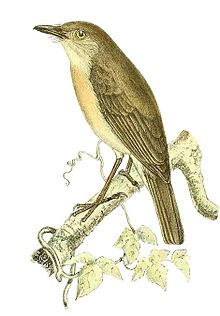

#Newtonia

A Google Search for personal use.

##Why?

Because of [Great Fire Wall of China](https://en.wikipedia.org/wiki/Great_Firewall), we Chinese can't use Google Search.

So I create this project base on [Google Web Search Api](https://developers.google.com/web-search/). 

It's very simple and only request the api, so it's very fast.

##Installation

    git clone https://github.com/yangsibai/g.sibo.io.git
    cd g.sibo.io/
    git get
    git run *.go

usage:

    curl http://127.0.0.1:8080/
    curl http://127.0.0.1:8080/search?q=go

##Limitation

1. Google Web Search Api has been deprecated, it may stop service someday.
2. Google Web Search Api has a request limitation, but I can't find the official document, someone from stackoverflow says it's 100/day. It's enough for personal use.

##About the name

[Newtonia](https://en.wikipedia.org/wiki/Newtonia_%28bird%29) is a genus of [vanga bird](https://en.wikipedia.org/wiki/Vanga). 

